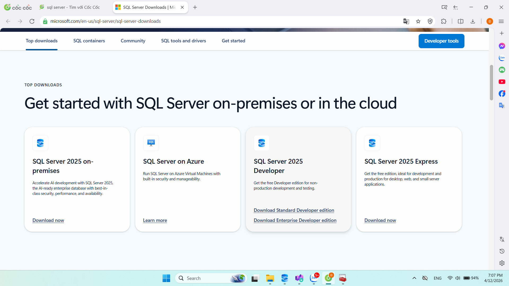
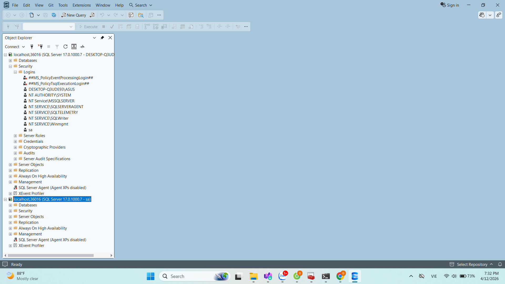

# diep

Nộp bài tập QTCSDL

Sinh Viên : Hoàng Đình Điệp- K235480106076 - K59KMT

### 1. Tải và cài đặt SQL Server 2025 Developer

### 2. Cấu hình cổng động (Dynamic Port)

### 3. Kiểm tra cổng 36016 có đang mở

### 4. Tải và kết nối đến SQL Server Management Studio

Kết nối bằng Windows Authentication

Tại phần đăng nhập của SQL Server Authentication, username mặc định là sa và password đặt là 123

### 5. Tạo cơ sở dữ liệu mới và chọn Path lưu cho file dữ liệu và file log

Kết quả thành công

### 6. Tạo bảng dữ liệu(các trường dữ liệu phù hợp) với khóa chính là trường masv

Sau khi hoàn tất lưu và đặt tên bảng

### 7. Import data from Excel file

### 8. Kiểm tra số dòng đã import vào

### 9. Insert 1 row vào bảng với dữ liệu là thông tin cá nhân của sv đang làm bài

Kết quả thành công

### 10. Update trường noisinh thành 'Sao Hoả' cho những dòng có noisinh và diachi đều là NULL.

Tạo bảng SaoHoa gồm những sinh viên có nơi sinh ở 'Sao Hoả'

### 11. Gõ lệnh xoá (delete) trong bảng SaoHoa những sinh viên cùng họ với em, vd em họ nguyễn thì xoá những sv họ Nghiêm.

### 12. Xuất toàn bộ kết quả của các bước ra file dulieu.sql

 Kết quả tạo thành công file

 

 

 ### 13. Xoá csdl đã tạo

 

 ### 14. Mở file Dulieu.sql, chạy toàn bộ 

### 15.  Upload file dulieu.sql lên github repository